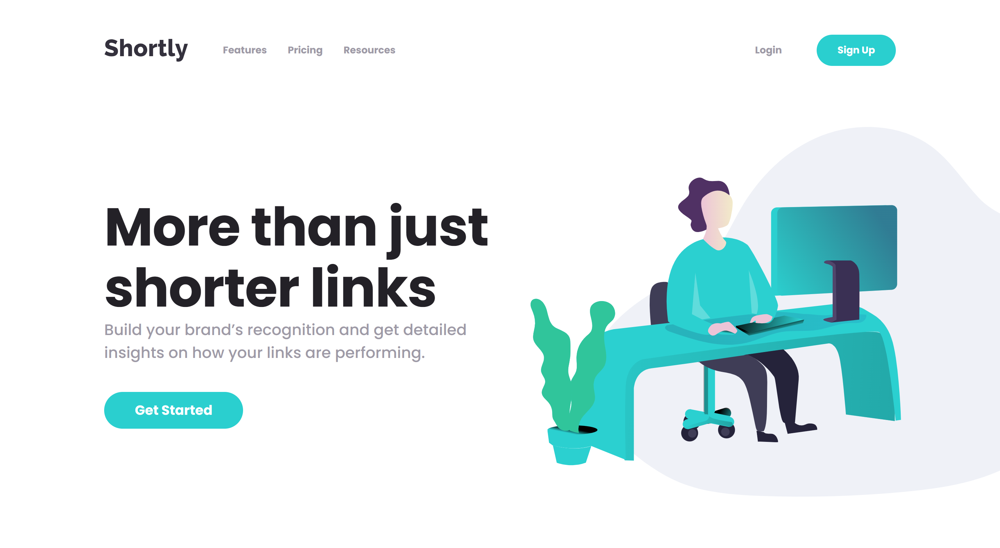

# Frontend Mentor - News homepage solution

This is a solution to the [URL shortening API landing page](https://www.frontendmentor.io/challenges/url-shortening-api-landing-page-2ce3ob-G). Frontend Mentor challenges help you improve your coding skills by building realistic projects. 

## Table of contents

- [Overview](#overview)
  - [The challenge](#the-challenge)
  - [Screenshot](#screenshot)
      - [Desktop](#desktop)
  - [Links](#links)
- [My process](#my-process)
  - [Built with](#built-with)
- [Author](#author)

## Overview

### The challenge

Users should be able to:

- View the optimal layout for the site depending on their device's screen size
- Shorten any valid URL
- See a list of their shortened links, even after refreshing the browser
- Copy the shortened link to their clipboard in a single click
- Receive an error message when the `form` is submitted if:
  - The `input` field is empty

### Screenshot

#### Desktop

### Links

- Solution URL: [My solution on Frontend Mentor](https://www.frontendmentor.io/solutions/url-shortening-api-landing-page-using-reactjs-fp4ebpIkdt)
- Live Site URL: [See my solution running](https://url-shortening-self-six.vercel.app/)

## My process

### Built with

- Semantic HTML5 markup
- Flexbox
- Mobile-first workflow
- [React](https://reactjs.org/) - JS library
- [Vite](https://vitejs.dev/) - Build Tool

## Author

- Frontend Mentor - [@nascimentolds](https://www.frontendmentor.io/profile/nascimentolds)

